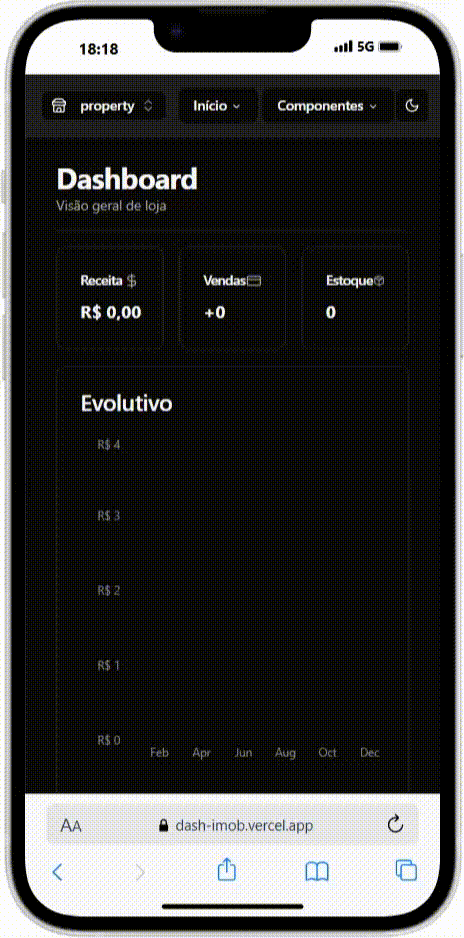

# Dash Genie - Dashboard e CMS
<div align="center">
<a href="https://dash-imob.vercel.app/">


</a>
<p><a href="https://dash-imob.vercel.app/">
Visualizar Prévia
</a></p>
</div>

O Genie tem como objetivo facilitar a gestão de e-commerce em tempo real. Acompanhado de um dashboard moderno e responsivo para acompanhar o financeiro, bem como uma tabela com a lista de vendas e pendencias. Construído com Next.js 14 e tecnologias modernas.  usando a tecnologia  
<div align="center">


</div>

## 🚀 Tecnologias Utilizadas

- [Next.js 14](https://nextjs.org/)
- [TypeScript](https://www.typescriptlang.org/)
- [Tailwind CSS](https://tailwindcss.com/)
- [Prisma](https://www.prisma.io/)
- [RDS AWS](https://aws.amazon.com/rds/)
- [Stripe](https://stripe.com/)
- [Zustand](https://github.com/pmndrs/zustand)
- [React Hook Form](https://react-hook-form.com/)
- [Zod](https://zod.dev/)
- [Recharts](https://recharts.org/)
- [Shadcn](https://ui.shadcn.com/)


## 📁 Estrutura do Projeto

```
dash-imob/
├── actions/           # Server actions do Next.js
├── app/              # Rotas e páginas da aplicação
├── components/       # Componentes React reutilizáveis
├── hooks/           # Custom hooks
├── lib/             # Utilitários e configurações
├── prisma/          # Schema e migrações do banco de dados
├── providers/       # Provedores de contexto
└── public/          # Arquivos estáticos
```

## 🛠️ Pré-requisitos

- Node.js 18.x ou superior
- npm ou yarn
- Banco de dados MySQL
- Conta no Stripe (para pagamentos)

## 🔧 Instalação

1. Clone o repositório:
```bash
git clone https://github.com/jessdebrito/dash-imob.git
cd dash-imob
```

2. Instale as dependências:
```bash
npm install
# ou
yarn install
```

3. Configure as variáveis de ambiente:
Crie um arquivo `.env` na raiz do projeto com as seguintes variáveis:
```env
DATABASE_URL="sua_url_do_banco_de_dados"
STRIPE_SECRET_KEY="sua_chave_secreta_do_stripe"
NEXT_PUBLIC_STRIPE_PUBLISHABLE_KEY="sua_chave_publica_do_stripe"
```

4. Execute as migrações do banco de dados:
```bash
npx prisma migrate dev
```

5. Inicie o servidor de desenvolvimento:
```bash
npm run dev
# ou
yarn dev
```

## 🌟 Funcionalidades

- Dashboard interativo com gráficos e métricas
- Gestão de imóveis
- Sistema de autenticação
- Integração com pagamentos via Stripe
- Tema claro/escuro
- Interface responsiva
- Análise de receitas e vendas

## 🤝 Contribuindo

1. Faça um Fork do projeto
2. Crie uma branch para sua feature (`git checkout -b feature/AmazingFeature`)
3. Commit suas mudanças (`git commit -m 'Add some AmazingFeature'`)
4. Push para a branch (`git push origin feature/AmazingFeature`)
5. Abra um Pull Request


## 📞 Contato

Caso nescessário, envie um email para contato@jessdebrito.com ou abra uma issue no repositório. Sinta-se a vontade para me contactar pelo idioma que mais se sentir confortável. Posso responder em: PT,ES,FR ou ENG.


### Agradeço por sua atenção, se a sua leitura chegou até aqui. 🖖🏽👽